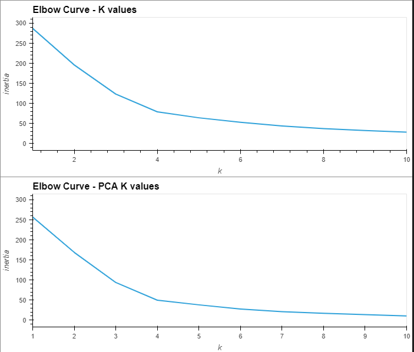
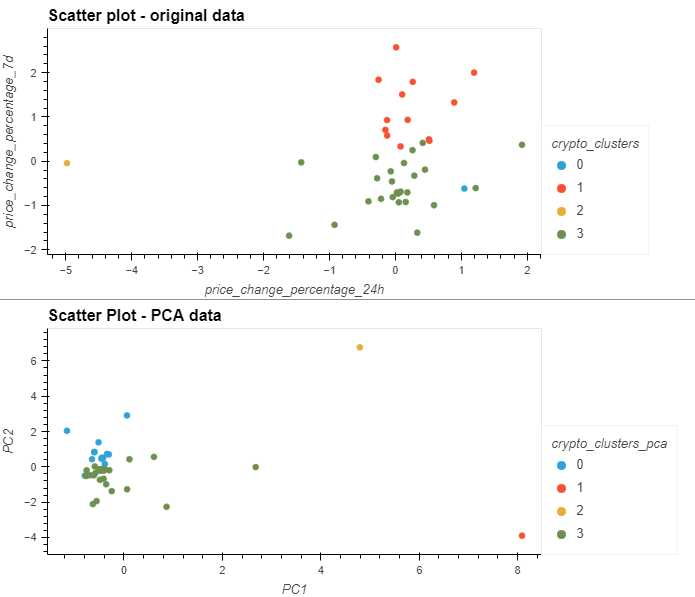

# Predicting whether crypto currencies are affected price changes

## **Overview**
Predicted whether cryptocurrencies    are affected by 24-hour or 7-day price changes using python and unsupervised learning.

Aspects to note:
- Cryptocurrencies clustered with K-means algorithm
- Elbow method used to find the optimal value of K for clustering the data
- Initialised, fitted and predicted the clusters for grouping the cryptocurrencies
- Used hvPlot to create a scatter plot with colour-coded labels for the different clusters.

Two models were run
- The first model using the original data
- The second using PCA to reduce the dimensionality of the data to three principal components.
 

## Outcome
After visually analysing the cluster analysis results, there is less inertia in the PCA model, the points are closer together and the clusters are more clearly defined.  Also the PCA scatter plot better separates out the two outliers (ethlend and celsius-degree-token).

---

### **Contact:**
Email: kymcoleman@gmail.com

---
 

***Folder structure***

 - '**Crypto_Clustering.ipynb**' - which contains the code, analysis and outputs for this assignment.
 - The folder  '**Resources**' holds the data file.
